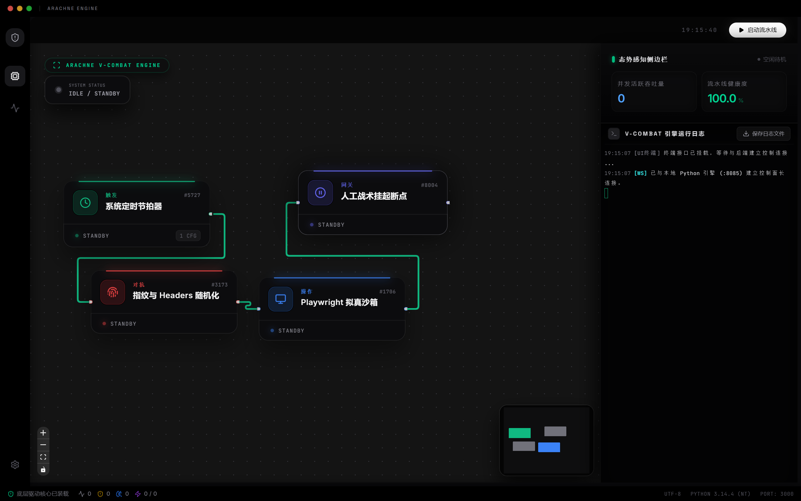

# ARACHNE - 认知智能与自动化游侠引擎

> 从零开始的数据采集与处理流水线，让机器像人一样理解并提取数据。

欢迎使用 ARACHNE！无论您是专业开发者还是完全不懂代码的新手，这套系统都能帮助您轻松搭建自动化的“数据采集流水线”。通过简单的连线拖拽，即可完成复杂的数据抓取、清洗和保存工作。

预览


---

## 🚀 安装与快速开始指南

对于想在自己电脑上运行此项目的朋友，只需按照以下简单的步骤操作：

### 环境准备 (必需)

1. **安装 Node.js**：前往 [Node.js 官网](https://nodejs.org/) 下载并安装较新版本（推荐 v18 或 v20 以上 LTS 版本）。
2. **安装 Python 3**：前往 [Python 官网](https://www.python.org/) 下载并安装 Python 3.10 或更高版本。（Windows 用户安装时请务必勾选 "Add Python to PATH"）。

### 部署步骤

**第一步：获取代码**
将本项目的代码下载或克隆到您的本地电脑上，并解压到一个文件夹中。

**第二步：配置大模型 API 密钥**
系统依赖大模型（如 Gemini、DeepSeek 等）来聪明地提取数据。

1. 在项目根目录下，找到名为 `.env.example` 的文件。
2. 把它复制一份，并重命名为 `.env`。
3. 用记事本打开 `.env` 文件，填入您拥有的大模型 API Key（例如把 `GEMINI_API_KEY="您的密钥"` 里的汉字替换成真实密钥）。

**第三步：安装依赖**
打开电脑的命令提示符（Windows 的 cmd/PowerShell，或 Mac/Linux 的 Terminal），进入到代码所在的文件夹，输入以下命令：

```bash
npm install
```

_这一步会自动下载所有需要的前端依赖包，请耐心等待（如果网络慢可以使用淘宝镜像 `npm install --registry=https://registry.npmmirror.com`）。_

**第四步：一键启动**
继续在命令提示符中输入：

```bash
npm run dev
```

_这个命令非常智能，它会自动帮您安装 Python 后端需要的包（比如 FastAPI、Playwright 等），并在安装完成后同时启动后端服务和前端界面。_

**第五步：开始使用**
启动成功后，在浏览器中打开命令行提示的网址（通常是 `http://localhost:3000` 或 `http://127.0.0.1:3000`），就可以看到积木界面了！

---

## 1. 核心概念：什么是“上下文 (Context)”机制？

许多新手都会疑惑：**当第一个节点读取了网页，后面的节点怎么知道网页内容是什么？** 这就归功于系统中最核心的“上下文”机制。

你可以把“上下文”想象成一个**在传送带（连线）上流动的魔法包裹（快递箱）**。

- **1. 产生空包裹**：流水线刚启动时，系统会产生一个空的魔法包裹，沿着你画的线传给第一个节点。
- **2. 往里塞入初级原料**：例如“读取网页”节点拿到了空包裹，它去互联网上抓取了一大堆网页代码（HTML），塞进包裹里，并在包裹上贴个标签：叫 `pageCode`。
- **3. 提纯与翻找**：包裹传到了“大模型提取”节点。它被告知去包裹里找 `pageCode` 标签的东西。大模型阅读了网页代码后，聪明地清理出了商品价格表。然后，它把价格表作为 `priceData` 重新塞回包裹里（原来的脏代码可以直接丢弃以节省空间）。
- **4. 拿取并写盘**：包裹流转到最后的“保存”节点，它直接从里面拿出带有 `priceData` 标签的干净数据，存到你的电脑硬盘上。

**总结**：你不需要编写复杂的编程代码，只要你把两个节点**用线连起来**，它们其实就是在互相传递这个“魔法包裹”。前面的节点往里放东西，后面的节点从里面拿东西加工。

---

## 2. 基础操作指南

系统的界面非常直观，您可以像搭积木一样操作：

1. **添加节点**：在左侧面板中，您可以浏览所有可用节点。找到需要的节点，鼠标**点击并拖拽**到中间的空白画布上。
2. **连接节点**：在节点方块的边缘有小圆点（连接端口）。按住鼠标从一个节点的右侧小圆点（输出）拖拽一条线，连到下一个节点的左侧小圆点（输入）。这就相当于修好了一段可以传递魔法包裹的传送带。
3. **配置参数**：点击画布上的某个节点，在右下方会弹出一个面板，可以在里面修改该任务的具体参数。比如对于“保存数据节点”，可以设置它保存到电脑上的具体路径。
4. **启动流水线**：编排完毕后，点击顶部的**“编译下发 (Compile)” 或 “执行策略 (Deploy)”** 按钮（Play图标）。系统就会从开头的触发节点开始，一步步自动执行！
5. **实时监控**：界面最下方和右侧的状态面板，会实时显示当前的运行轨迹、网络往返时间、处理了多少条数据、大模型消耗了多少次调用。

---

## 3. 常用的节点说明

系统内置了多种节点，按工序分为以下几类：

### 🎯 起点：触发与起步 (Trigger)

流水线必须要有开头。

- **调度打火机 (Cron Trigger)**：用来设置定时任务（比如：每隔5分钟自动执行一次，或每天早上 8 点自动执行一次）。

### 🚪 获取：拿取第一手数据 (Read / Fetch)

- **静态抓取探针 (HTTP Request)**：速度最快，适合直接获取简单的网页或 API 数据。
- **沉浸式沙箱 (Browser Sandbox)**：会真实打开一个隐形的浏览器（还能模拟真人防止被封杀），适合抓取那些需要加载动画或防爬的复杂网站。
- **直接读取本地文档**：直接读取您电脑本地的 `JSON` 或 `TXT` 文本数据作为流水线的原料。

### 🧠 核心：提取与清洗 (AI & Extractor)

将获取到的杂乱数据提炼成想要的核心内容。

- **大模型降维提纯 (LLM Extractor)**：这是本系统的灵魂节点！您不用懂代码或正则表达式，只需用大白话填在配置里：“帮我把包裹里的网页中的商品名称、价格提取出来，并去掉广告”。大模型会自动理解，把杂乱的文本变成结构齐整的表格数据。

### 🛡️ 辅助：处理与防御 (Filter / Evasion)

- **物理减脂引擎 (Data Filter)**：如果数据量太大，能在交给大模型前，过滤砍掉明显无关的网页垃圾，帮你节省大模型 Token（请求费用）。
- **代理 IP 池 (Proxy)**：遇到限制IP的网站时，可以自动切换网络身份。

### 📦 终点：归档与结束 (Output / Delivery)

- **固化成石 (JSON/CSV Export)**：将上下文包裹里清洗完毕的数据，落盘保存为大家都能看懂的 JSON 或 CSV 文件。

---

## 4. 软件的实现逻辑概览

如果你好奇这套积木底层是怎么跑起来的，这里是它的极简工作原理：

1. **拖拽画板 (React 前端)**：你在浏览器里看到的拖拽界面，本质上只是一个画图工具，它负责把你画的这套流水线“翻译”成一张包含节点和连线信息的**配置图纸**（JSON格式）。
2. **派发指令**：当你点击执行时，前端会通过网络将这张图纸发给后端的**调度大脑**。
3. **真实干活 (Python 引擎后端)**：
   - 调度大脑是一个由 Python 编写的引擎，它看懂了你的图纸。
   - 它开始顺着你的连线，依次找到对应的底层 Python 代码片段。
   - 它在后台为你发送真实的 HTTP 网页请求，真的打开一个无头浏览器去下滑网页，真的去调用大模型的接口去提炼文字...
   - 就像接力赛一样，后端引擎把每一步的成果无缝移交给下一步的代码。
   - 这个引擎还利用了 `asyncio`（异步技术），意味着它可以同时开很多个“工人”去抓网页，速度飞快，而且你几乎感觉不到卡顿。

这一切底层技术细节都在无感中发生，非专业用户只需要关心“逻辑上我要实现什么”，底层的并发、通信、等待，全交给 ARACHNE 去处理就行了！

> 🎉 **快去运行 `npm run dev`，拖拽您的第一个节点，开启全自动化的数据漫游之旅吧！**
